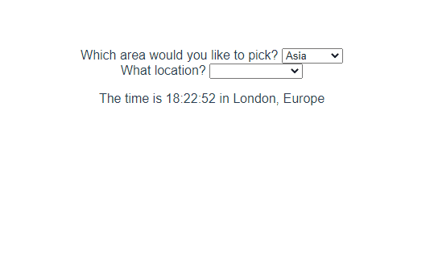

# Time and Date for Locations based on World Time API

Simple app that gets the local times, made for a takehome. Uses World Time API
and VueJS.



## Project setup
```
npm install
```

### Compiles and hot-reloads for development
```
npm run serve
```

### Compiles and minifies for production
```
npm run build
```

### Lints and fixes files
```
npm run lint
```

### Customize configuration
See [Configuration Reference](https://cli.vuejs.org/config/).
